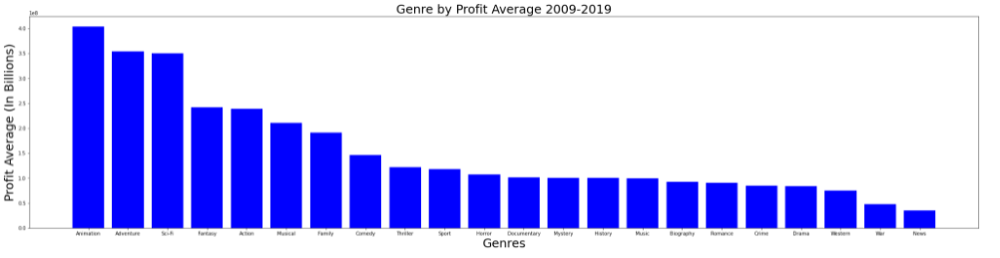

## Phase 1 Movie Analysis - Myrna Grace Calip 

### Business Problem

Microsoft is looking to create a movie studio and wants to analyze the given data to make three business recommendations. I will be focusing on genre, production profit, and release time. 

### The Data

The data I will be using is: 

* [IMDB](https://www.imdb.com/)
* [The Numbers](https://www.the-numbers.com/)

### Business Value

The following questions we will be answering is:

- When is the best time to release a film?
- Which genre generates the most profit?
- Does Production Budget correlate to a more Profitable Movie?

Once we gather our information we will determine the recommendations Microsoft needs to release a film that will catch the eye of the audience.

### Methology
- Importing and exploring IMDB to feel the data
- Data Cleansing and Analysis
- Results

### When is the best time to release a film?

- Goal: Find which part of the year is the best time to release a movie based on The Numbers' Profits

1. Load the The Numbers, reformat and set a time frame by looking at The Numbers frequency to set the parameters of years to choose from.

We see that the majority of data is around 2009s-2019s vicinity. So we use the data that is within 2009-2019s.

2. Group the movies that were released in 2009-2019 by month and profit. 

- Results: The highest profiting months are May, June, November, and December.

### Which genre generates the most profit?

- Goal: Find which genre generates the most profit using data from The Numbers and IMBD combined 

- Results: The highest profiting genre based on the average profit of 2009-2019 is Animation, Adventure, Sci-fi, Fantasy, and Action.

### Does production budget correlate to profit?

- Goal: Use the dataset from question 1 to determine the correlation between production budget and profit.

Result: The correlation between Production Budget and Profit is .702 meaning it is a medium positive correlation. Based on the scatterplot, it is best to budget at least 200M-300M to hit the profit range of 2-2.5 billion.

# Conclusion

Given from our findings, the best recommendations I could give is are the following:

1. Release Movies during the end of the year and summer time such as - May, June, July, November, December
2. The genres to consider writing is Animated Movies, Adventure, Sci-fi, Fantasy and Action based on the highest profiting average.
3. 200M-300M Budget will provide a profitable Movie. 

## Insights to explore in the Future

1. Profits of movies from streaming platforms
2. Highly Rated Directors
3. Dig Deeper into Production Budget Ranges vs. Profitability %
4. High Rated Movie Studio's/Competition's Profits and Revenue
5. How Does Popularity Correlate to Most Frequently Watched Genres

